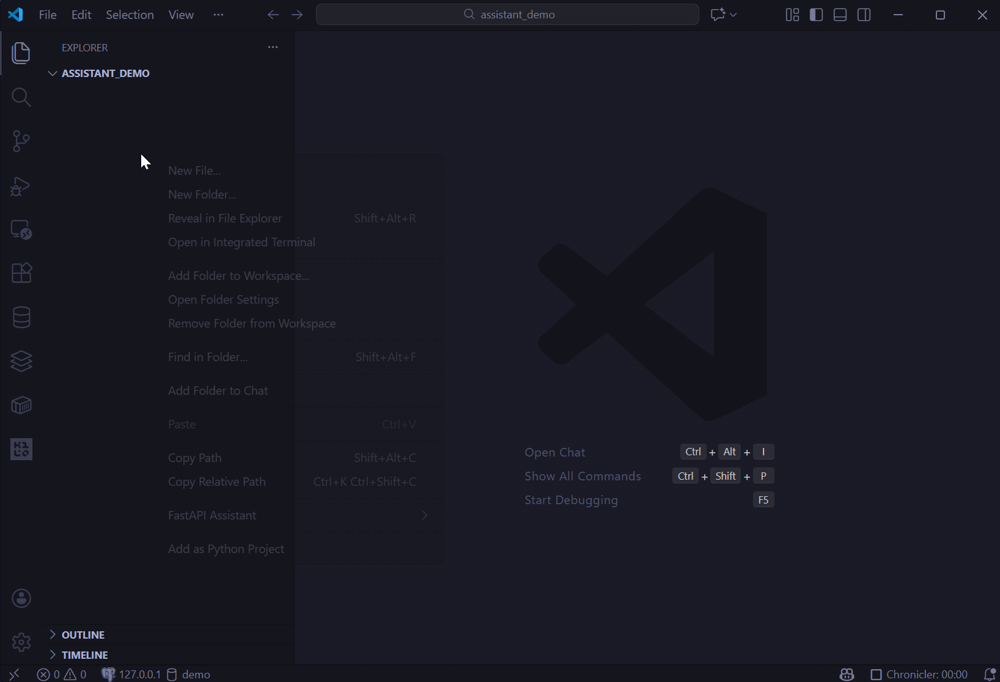
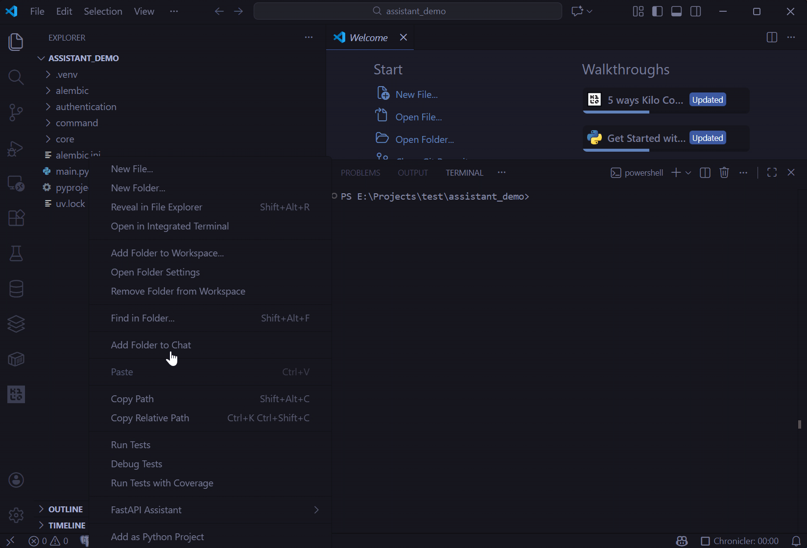
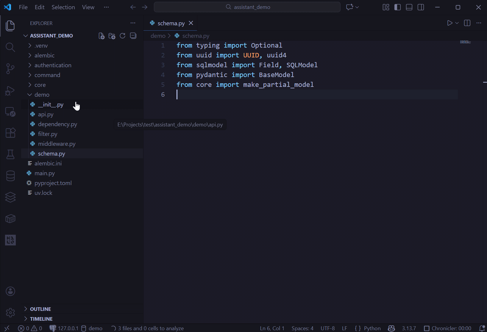
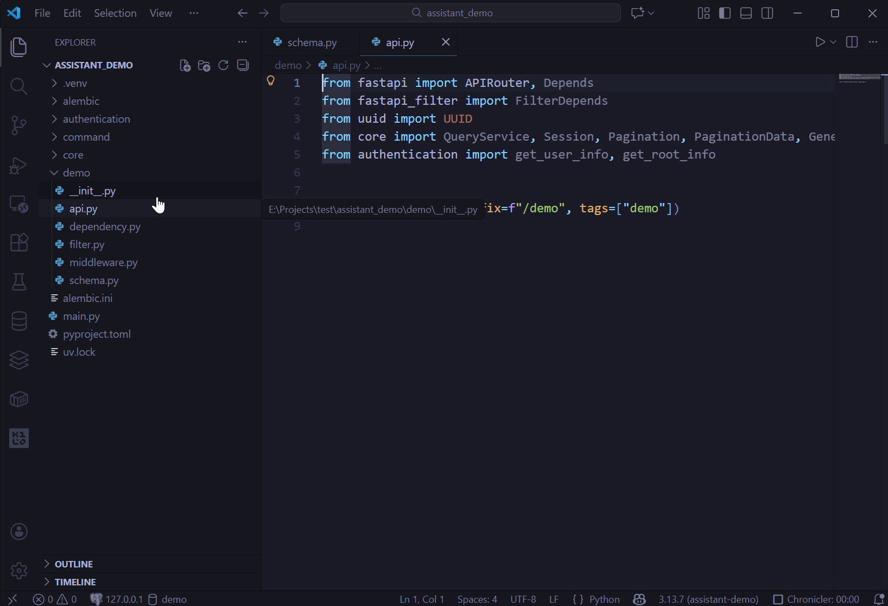
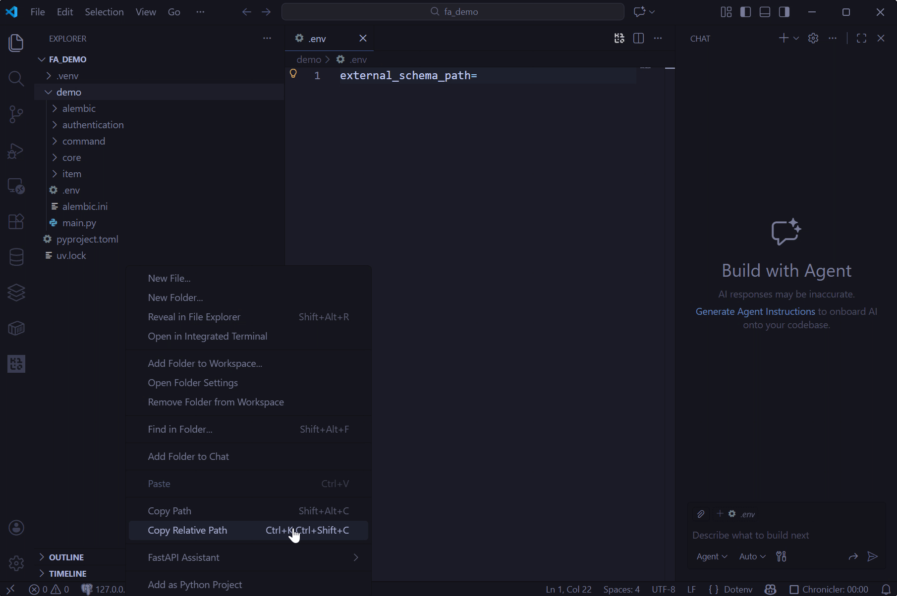
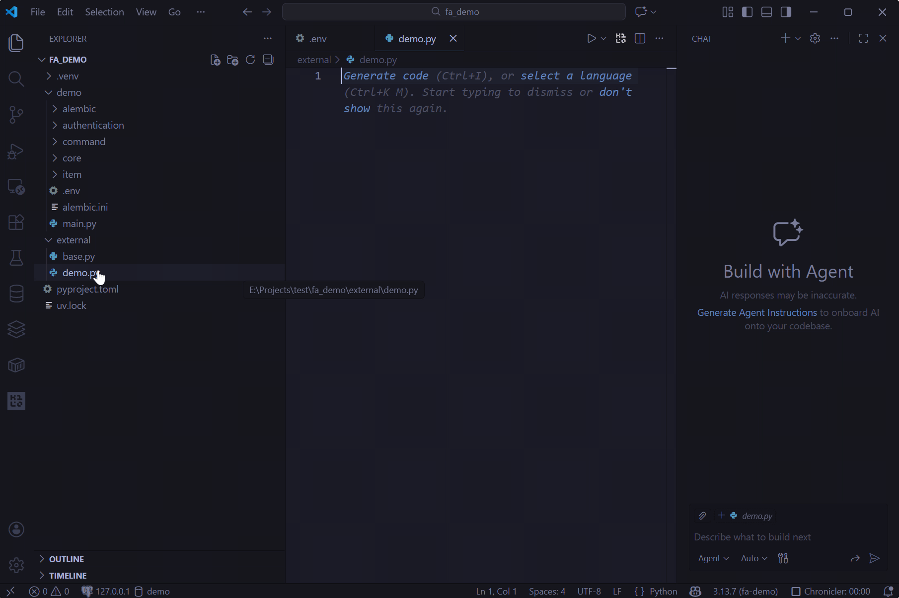
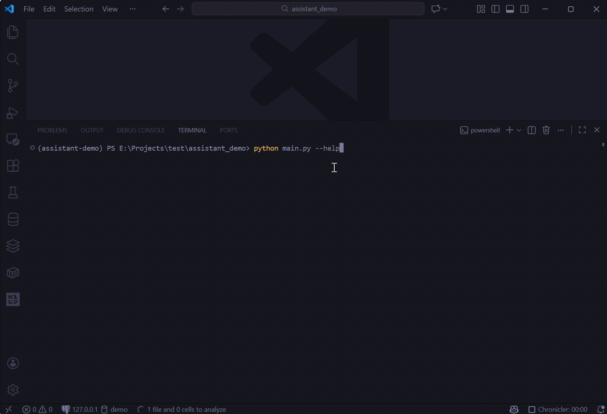
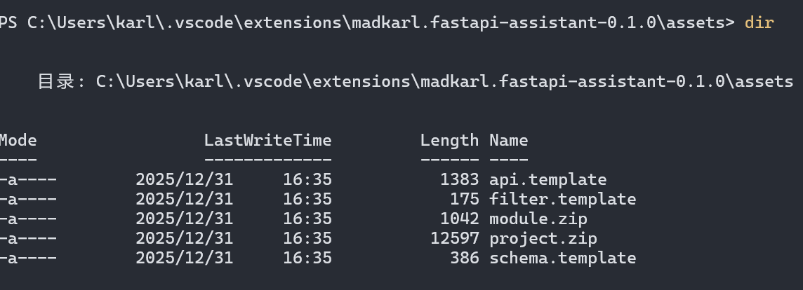

# FastAPI Assistant
FastAPI Assistant is a Visual Studio Code extension that streamlines the quick creation of FastAPI projects and modules, as well as the automatic generation of schemas, filters, and APIs.

## What' news?
- 2026.01.26: Support creating `External Schema Directory` in multi-project environments, allowing multiple projects to share a common schema

## Features

- Quick FastAPI Project Creation
  - Create projects via `uv`, with automatic installation of essential dependencies including FastAPI, SQLModel, psycopg, Alembic, and JWT
  - Set up the project file structure
  - Integrate core features such as user authentication, user management, automatic route registration, and schema-aware database migrations
- Quick FastAPI Module Creation
- Quick FastAPI Schema and Filter Creation
- Quick FastAPI API Creation (with basic CRUD functionality)
- Create External Schema directory for reuse across multiple projects
- Quickly create External Schema
- CLI Mode Support (similar to django's manage.py)

## Usage
Most features of FastAPI Assistant are accessible via the right-click context menu in the Explorer panel.

### Create Project
Create a FastAPI project at the selected location (supports project creation in any directory within the workspace)

### Create Module
Create a FastAPI module at the selected location

### Create Schema
Add a set of schemas to schema.py and corresponding filters to filter.py within the module at the selected location

### Create API
Add basic CRUD operation APIs for the corresponding schema to api.py within the module at the selected location

### Create External Schema Directory

In multi-project environments, you can create an external schema directory to share schemas across multiple projects

`!!! If the plugin fails to update the .env file automatically, please manually update the external_schema_path field in the .env file under your FastAPI project. This field supports both relative and absolute paths.`

### Add External Schema
Add Schema group (including Read, Create, Update models) to External Schema Directory

### Command Line
Execute CLI commands using the syntax: "python [OPTIONS] COMMAND [ARGS]` 

Supported Commands: 
- migrate: Run database migrations with Alembic
- root-user: Create an administrator user
- serve: Start the FastAPI application with Uvicorn

## Update Project Template
If you are not satisfied with the current project template, you can modify the project template style yourself. The template files are stored in`[Extension Installation Directory]/assets` directory.

## Requirements

-  [uv](https://pypi.org/project/uv/): An extremely fast Python package and project manager, written in Rust.

## Release Notes

- 0.1.2: Support creating `External Schema Directory` in multi-project environments, allowing multiple projects to share a common schema

- 0.1.1：Add background task support by [taskiq](https://taskiq-python.github.io/)

- 0.1.0: Initial usable version. Implements project creation, module creation, schema generation, and API generation.

